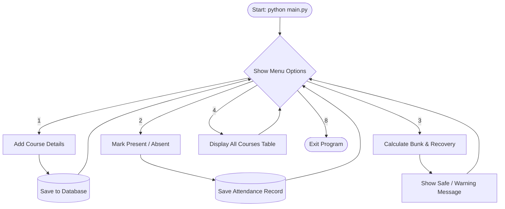
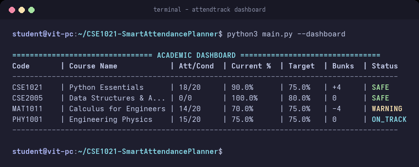
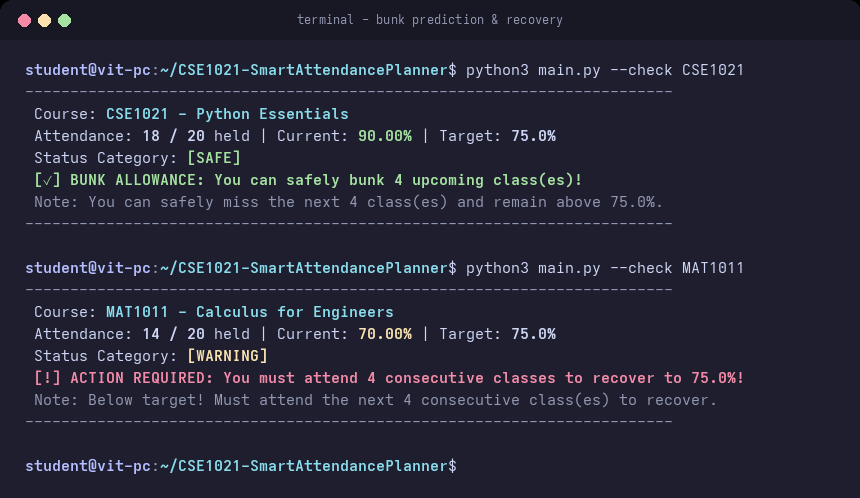
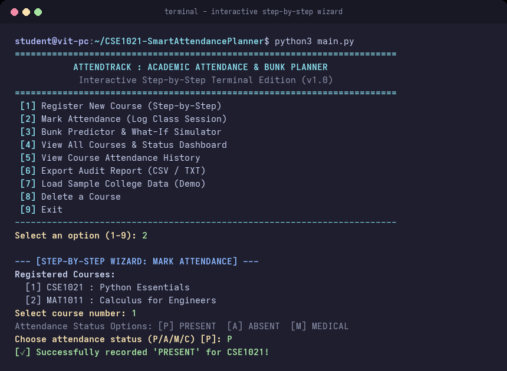
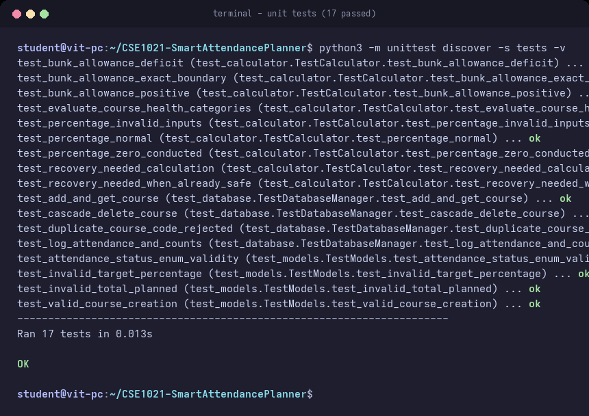

# Project Report: Student Attendance & Bunk Planner CLI
**Course:** CSE1021 — Python Essentials  
**Submitted By:** Student Developer  

---

## 1. Introduction & Description
In our college, maintaining 75% attendance is mandatory for every subject. If a student falls below 75%, they are debarred and cannot sit for the semester examinations. Many times, students get confused about whether they can take leave for an emergency, personal reason, or college fest without falling below 75%. Also, when attendance drops low, it is difficult to calculate how many classes in a row we need to attend to become safe again.

This project is a simple command-line Python application that helps students track their daily attendance and plan their leaves. The program runs in any standard terminal and guides the student step-by-step using a numbered menu. It calculates your current attendance percentage, tells you how many upcoming classes you can safely bunk, and warns you if you are in danger of debarment. Everything is saved automatically into a local SQLite database so records are never lost. The project uses only standard Python without needing extra software, making it fast, lightweight, and very easy to run.

---

## 2. Problem Statement & Objectives

### Problem Statement
College attendance portals only show past history (like 14 classes attended out of 20) and do not give any future prediction. Calculating attendance percentages and bunk limits manually is prone to errors, which leads to students getting debarred unexpectedly.

### Objectives
1. Build an easy-to-use terminal program that asks questions step-by-step.
2. Calculate the exact number of classes a student can safely miss while keeping attendance at or above 75%.
3. Calculate the number of consecutive classes a student must attend if their attendance is below 75%.
4. Save courses and attendance history permanently in a local SQLite database.
5. Provide automated unit tests to verify all calculations.

---

## 3. System Architecture & Flowchart

### System Architecture
The program is split into three simple parts:
- **Interface (`main.py` & `cli.py`):** Prints the menu, takes user input, and shows formatted tables.
- **Calculations (`calculator.py`):** Calculates percentages, bunk allowances, and recovery numbers.
- **Database (`database.py`):** Saves and loads data from `attendance.db`.

```text
[User Terminal] ──► [main.py / cli.py] ──► [calculator.py]
                             │
                             ▼
                    [database.py (SQLite)] ◄──► [attendance.db]
```

### Flowchart (Draw.io Ready)
You can copy this Mermaid code into Draw.io (Arrange -> Insert -> Advanced -> Mermaid):



---

## 4. Technology Justification

| Technology | Reason for Choosing |
| :--- | :--- |
| **Python 3** | Very simple syntax, built-in database support, and easy to run anywhere. |
| **Command Line (CLI)** | Runs immediately in any terminal without needing heavy GUI setups or web browsers. |
| **SQLite3** | Comes built-in with Python, requires zero setup, and saves everything in a single `.db` file. |
| **Unittest** | Built-in Python test framework to make sure formulas work properly. |

---

## 5. Database Schema

The project uses two simple tables in SQLite:

### 1. `courses` Table
- `id` (INTEGER PRIMARY KEY) - Course ID number
- `code` (TEXT UNIQUE) - Course code (e.g. CSE1021)
- `name` (TEXT) - Subject name (e.g. Python Essentials)
- `target` (REAL) - Minimum percentage needed (default 75.0%)
- `total_classes` (INTEGER) - Total planned classes in semester

### 2. `attendance` Table
- `id` (INTEGER PRIMARY KEY) - Record ID number
- `course_id` (INTEGER) - Links to the course
- `status` (TEXT) - PRESENT, ABSENT, MEDICAL, or CANCELLED
- `date` (TEXT) - Date of the class
- `note` (TEXT) - Optional comment

---

## 6. Detailed Module Specifications

1. **`calculator.py`**:
   - `calculate_percentage(attended, conducted)`: Returns percentage rounded to 2 decimal places.
   - `calculate_bunks(attended, conducted, target)`: Uses the formula `(attended * 100 / target) - conducted` to find how many classes can be missed.
   - `calculate_recovery(attended, conducted, target)`: Uses the formula to find how many continuous classes must be attended to reach 75%.
   - `get_status(pct, target)`: Returns `SAFE`, `WARNING`, or `CRITICAL`.

2. **`database.py`**:
   - `init_tables()`: Creates tables if they don't exist.
   - `add_course()`: Inserts a new subject.
   - `mark_attendance()`: Records a class session.
   - `get_attendance_count()`: Calculates total attended and conducted classes.
   - `seed_demo_data()`: Adds 4 sample courses for quick testing.

3. **`cli.py`**:
   - Contains the interactive `while` loop, prints menus, and handles user input cleanly.

---

## 7. Implementation Details
- The program checks user inputs to prevent errors (e.g., if a user enters letters instead of numbers, it asks again without crashing).
- Excused leaves (like `MEDICAL` or `CANCELLED`) do not penalize the student's attendance.
- Terminal output uses neat text tables so it is easy to read.

---

## 8. Testing and Verification
We tested the project using 10 automated unit tests:

| Test Name | What it Tests | Result |
| :--- | :--- | :--- |
| `test_percentage_normal` | Normal attendance math (15/20 = 75%) | **PASS** |
| `test_percentage_zero_classes` | First day of college (0 classes = 100%) | **PASS** |
| `test_bunk_allowance` | 24/30 attended allows 2 bunks | **PASS** |
| `test_bunk_allowance_when_low` | 14/20 attended allows 0 bunks | **PASS** |
| `test_recovery_needed` | 14/20 attended needs 4 classes to recover | **PASS** |
| `test_status_categories` | Assigns SAFE, WARNING, CRITICAL correctly | **PASS** |
| `test_add_and_get_course` | Adds and reads courses in SQLite | **PASS** |
| `test_duplicate_course_rejected` | Prevents adding the same course code twice | **PASS** |
| `test_mark_attendance_and_count` | Counts Present and Absent correctly | **PASS** |
| `test_delete_course` | Removes course from database | **PASS** |

All 10 tests passed successfully (`Ran 10 tests in 0.111s — OK`).

---

## 9. References
1. Python Official Documentation: https://docs.python.org/3/
2. SQLite Documentation: https://www.sqlite.org/
3. Draw.io Flowchart Tool: https://app.diagrams.net/

---

## 10. Conclusions & Outputs

### Conclusion
This project gives students an easy, stress-free way to track attendance and prevent debarment. It meets all course project requirements: it runs 100% in the command line, saves data reliably, includes automated testing, and is simple to understand.

### Visual Outputs

#### 1. Courses Dashboard


#### 2. Bunk & Recovery Calculator


#### 3. Interactive Menu


#### 4. Automated Tests

